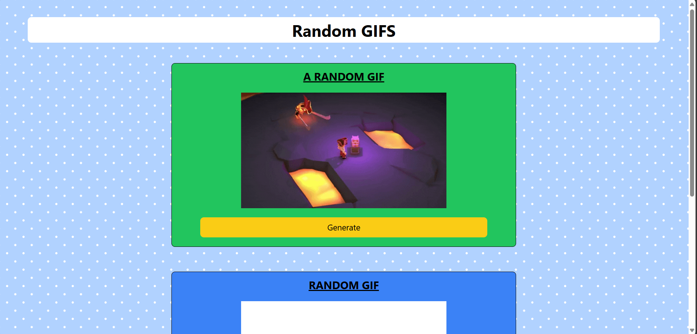

# 🎥 Random GIF Generator (React + GIPHY API)

A simple React app that fetches and displays random GIFs using the **GIPHY API**.  
You can either generate **completely random GIFs** or search by a **custom tag/keyword**.

---

## 🚀 Features
- Fetch random GIFs from GIPHY  
- Search GIFs by tag (e.g., `car`, `dog`, `funny`)  
- Loading spinner while fetching data  
- Responsive UI with TailwindCSS  
- Custom React Hook (`useGif`)  

---

## 🛠️ Tech Stack
- React.js  
- Axios (for API requests)  
- TailwindCSS (for styling)  
- GIPHY API  
- Custom Hook (`useGif`)  

---

## ⚙️ Setup Instructions

1. **Clone the repository**
   ```bash
   git clone https://github.com/pavankumar280/random-gif-generator.git
   cd random-gif-generator
Install dependencies

bash
Copy code
npm install
Get your GIPHY API Key

Go to Giphy Developers

Create an app and copy your API key

Create a .env file in the project root:

init
Copy code
REACT_APP_GIPHY_API_KEY=your_api_key_here
Start the development server

bash
Copy code
npm start

## 📸 Screenshots

### Random GIF  


### Tagged GIF  


🔮 Future Improvements
Add trending GIFs section
Download or share GIFs
Dark mode support

👨‍💻 Author
Pavankumar P. Sonune

yaml
Copy code
